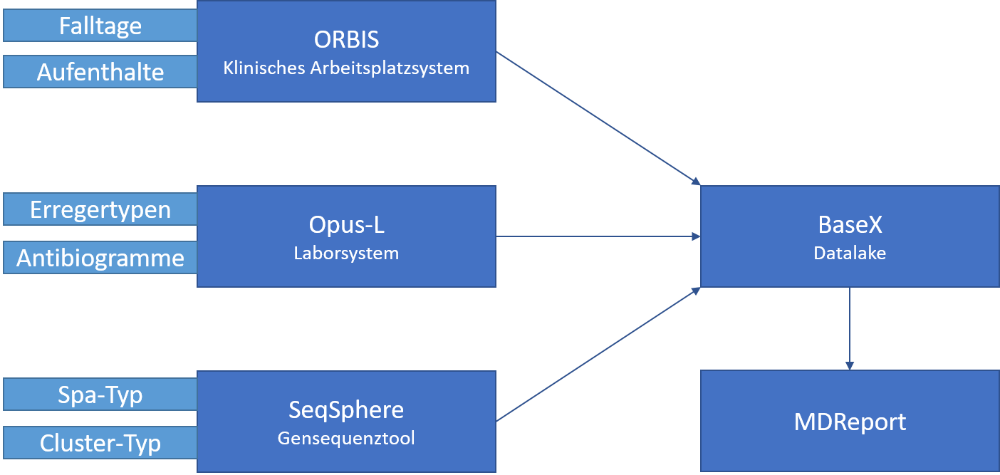
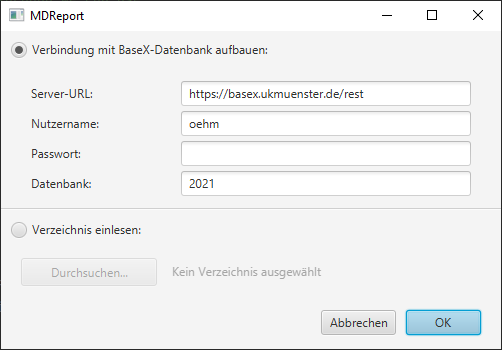
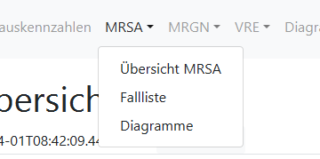
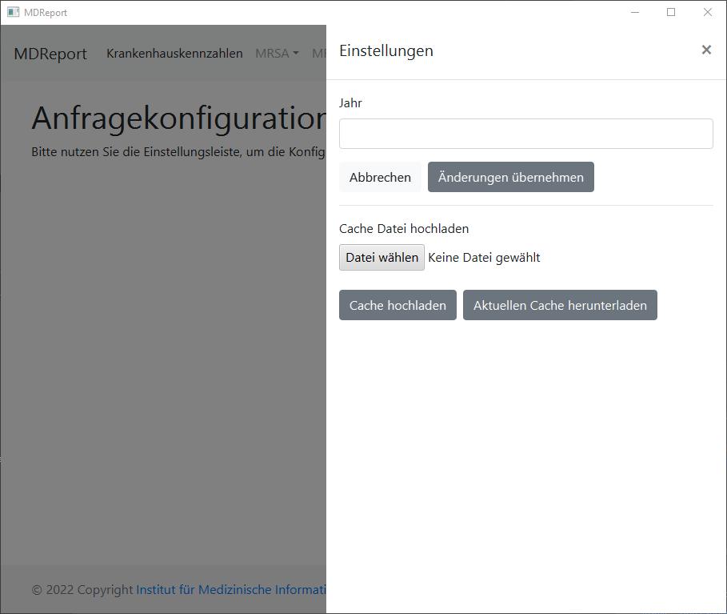
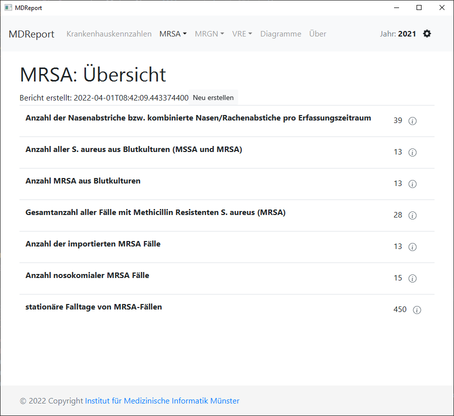
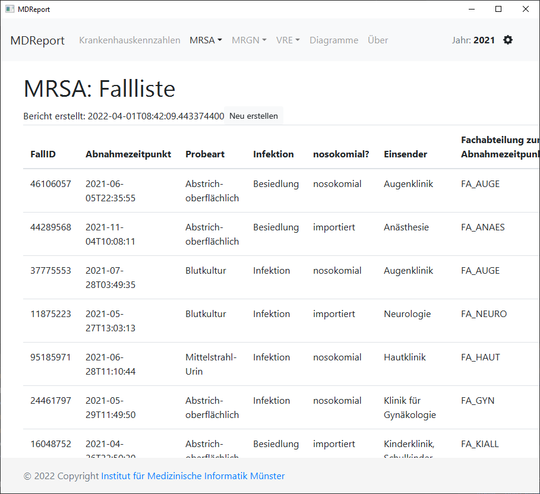
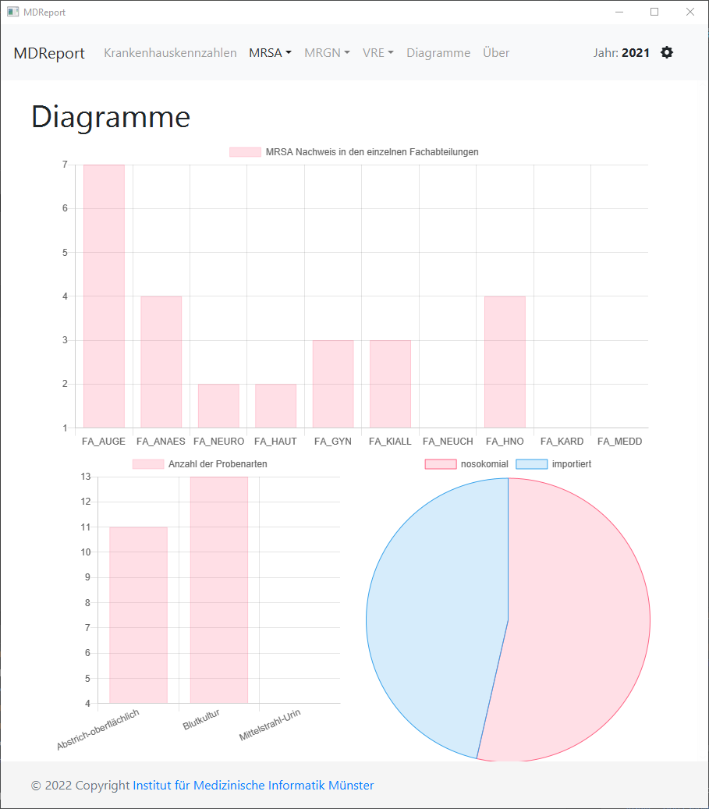
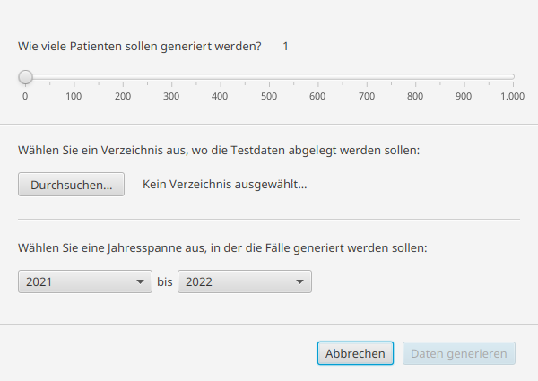

# MDRO-Report

This tool is used to create the surveillance report according
to [§ 23 IfSG](https://www.gesetze-im-internet.de/ifsg/__23.html) by running XQuery queries.

MDROs is short for multidrug-resistant organisms, also known in GERMAN as MRE (Multi-Resistente Erreger). The following
germs are supported by this tool:

| abbr | 🇬🇧                                        | 🇩🇪                                          |
|------|---------------------------------------------|-----------------------------------------------|
| VRE  | Vancomycin-resistant enterococci            | Vancomycin-resistente Enterokokken            |
| MRGN | Multi-resistant gram-negative pathogens     | Multiresistente gramnegative Erreger          |
| MRSA | Methicillin-resistant Staphylococcus aureus | Methicillin-resistenter Staphylococcus aureus |



## Download

You can download the pre-built binaries
from [our institute's GitLab Release page](https://imigitlab.uni-muenster.de/published/medic/mre-report/-/releases). You
can decide between a

* Pre-build executable .jar file (*MDROReport-Full.jar*, requires an installation of the Java Runtime Environment (JRE)
  *version 21* or higher)
* An executable installer, which will install MDRO-Report alongside its own JRE and creates a Start Menu entry
* A .jar file, that does not include BaseX or JavaFX (*MDROReport-Light.jar*, requires separately installed JRE and
  [BaseX](https://basex.org/) server, run with command line to set connection data)
* A .war file for server deployment (tested with tomcat, usage instructions see below)
* A Docker container (run `docker pull wwwuimi/mdroreport`)

## Usage

At startup, a window will ask you to enter the credentials to your BaseX instance.



As an alternative, you can import a folder of .xml-files. A built-in BaseX-server will load all the files and answer the
queries.

After start, please use the navigation bar at the top to switch between the different germs. The data for each germ is
created on demand and cached.



The queries are parameterized by year, so at first, you will be asked to set up a year. You can change the parameter by
clicking on the gear on the top right.







## Building

⚠ ❗ ⚠ **Requires: Java 21** (or later) ⚠ ❗ ⚠

Run

* `./gradlew shadowJar` to create an executable .jar file (*MDROReport-Full.jar*).
* `./gradlew CreateEXE` to create a Windows installer, that will also install JRE. Note you have to
  use Windows and install [WiX](https://github.com/wixtoolset/wix3) first.

If you only want to use the web interface and connect to a separate running BaseX-instance, run:

* `./gradlew :webapp:war` to create a .war file.
* `./gradlew :webapp:shadowJar` to create an executable .jar with built-in Netty server (*MDROReport-Light.jar*).

## Server Deployment via Tomcat or WildFly

1. Prerequisite: You need to have installed a BaseX instance, which is constantly fed the data from the ETL process.
2. Setup Tomcat server, I strongly recommend also installing a reverse proxy with some sort of password protection.
3. **Either**: Checkout the source code, edit `webapp/src/main/resources/application.conf`,
   execute `./gradlew :webapp:war`. <br>
   **Or**: Download .war file from releases, unzip, edit `WEB-INF/classes/application.conf`, rezip and deploy.
4. Have fun!

## Server Deployment via Docker 🐳

You can create run the server to connect with an external BaseX-instance. To build and run, check out and execute:
`docker build -t wwuimi/mdroreport . && docker run -p 127.0.0.1:8080:8080 -e SERVER_URL=https://basex.ukmuenster.de/ -e USERNAME=oehm -e PASSWORD=secret -e DATABASE=2022 wwuimi/mrereport`

Please add some password protected reverse proxy in front of the application when deployed to a public server.

## XML Format description

MDRO-Report uses a BaseX instance that provides XML data. The XML data has to follow these model specifications:

The main tree follows this structure:

```xml

<patient>
    <case>
        <location/>
        <labReport>
            <request/>
            <sample>
                <comment></comment>
                <germ>
                    <comment></comment>
                    <antibiotic>
                        <result/>
                    </antibiotic>
                </germ>
            </sample>
        </labReport>
    </case>
</patient>
```

For each of these objects the following attributes are important:

### patient

- **id** - the id of the patient. This can be any number. The ID has to be unique.
- **birthYear** - each patient has a birth year. It is a four digit long number YYYY
- **sex** - The sex of a patient. It can be "F" or "M"

Example:

```xml

<patient birthYear="1970" sex="F" id="5630133">...</patient>
```

### case

- **id** - the id of the case. This can be any number. The ID has to be unique.
- **from** - the start date-time of the case. It follows the ISO-8601 standard.
- **till** - the end date-time of the case. It follows the ISO-8601 standard.
- **type** - the type of the case. With this tool only stationary cases are important so any other type than "
  STATIONAER" will be ignored

Example:

```xml

<case id="99814764" from="2021-04-15T19:14:46" till="2021-05-09T03:14:20" type="STATIONAER">...</case>
```

### location

- **id** - the id of the location. This can be any number. The ID has to be unique.
- **from** - The date time when the patient was transferred to this location. It follows the ISO-8601 standard.
- **till** - The date time when the patient was transferred to a different location or dismissed. It follows the
  ISO-8601 standard.
- **clinic** - The clinic where the patient was located. Can be any string.

Example:

```xml

<location id="8909885" from="2021-04-15T19:14:46" till="2021-05-09T03:14:20" clinic="FA_GYN"/>
```

### labReport

- **id** - the id of the lab report. This can be any number. The ID has to be unique.
- **source** - the source of the labReport data. The labReport is extracted in the ETL-process. This can be any string.

Example:

```xml

<labReport id="32005541" source="MIBI">...</labReport>
```

### request

- **from** - the date time when the request was received. It follows the ISO-8601 standard.
- **sender** - which clinical department send the lab report request. This can be any string.

Example:

```xml

<request from="2021-04-16T19:14:46" sender="Klinik für Gynäkologie"/>
```

### sample

- **bodySiteDisplay** - the body site where the sample was taken. This can be any string
- **display** - the type of sample (i.e. how the sample was taken). This can be any string
- **from** - the date time when the sample was taken. It follows the ISO-8601 standard.

Example:

```xml

<sample from="2021-04-16T19:14:46" bodySiteDisplay="Nase und Rachen" display="Abstrich-oberflächlich">...</sample>
```

### germ

- **id** - the id of the germ. This can be any number. The ID has to be unique.
- **display** - the type of germ. This can be any string containing the name
- **SNOMED** - The conceptID of the germ from the SNOMED nomenclature. It can be any string

Example:

```xml

<germ id="25403319" SNOMED="3092008" display="Staphylococcus aureus">...</germ>
```

### comment

This explanation is specific to the comment that is attatched to the germ node.

- **class** - The class of the germ. This can be any String, but only MRSA, MRGN3, MRGN4 and VRE will be processed by
  this tool. The class information is computed by various conditions during the ETL-Process

Example:

```xml

<comment class="MRSA">...</comment>
```

### antibiotic

- **LOINC** - The corresponding LOINC code for the antibiotic. This has to be the correct code, otherwise the
  antibiotics result can not be processed
- **display** - The name of the antibiotic. This can be any string.

Example:

```xml

<antibiotic LOINC="18862-3" display="Amoxicillin/Clavulansäure">...</antibiotic>
```

### result

- **string** - The result string of the Antibiotics test. This can be "R" (Resistant), "S" (Sensible) or "I" (
  Intermediary)
- **LOINC** - The corresponding [LOINC](https://loinc.org/) code for the antibiotics result.

Example:

```xml

<result string="R" LOINC="LA6676-6"/>
```

Following this structure a valid example for a VRE-case could look like this:

```xml

<patient birthYear="1989" sex="M" id="14550404">
    <case id="25136654" from="2021-03-11T23:33:15" till="2021-03-26T04:39:08" type="S">
        <location id="38157576" from="2021-03-11T23:33:15" till="2021-03-26T04:39:08" clinic="FA_ANAES"/>
        <labReport id="93047653" source="MIBI">
            <request from="2021-03-12T23:33:15" sender="Anästhesie"/>
            <sample from="2021-03-12T23:33:15" bodySiteDisplay="Blut-zentral entnommen" display="Blutkultur">
                <comment>
                    No comment
                </comment>
                <germ id="39573318" SNOMED="90272000" display="Enterococcus faecium">
                    <comment class="VRE">
                        Germ generated by Testdata Generator
                    </comment>
                    <antibiotic LOINC="29258-1" display="Linezolid">
                        <result string="S" LOINC="LA24225-7"/>
                    </antibiotic>
                    <antibiotic LOINC="42357-4" display="Tigecyclin">
                        <result string="S" LOINC="LA24225-7"/>
                    </antibiotic>
                    <antibiotic LOINC="19000-9" display="Vancomycin">
                        <result string="R" LOINC="LA6676-6"/>
                    </antibiotic>
                    <antibiotic LOINC="18989-4" display="Teicoplanin">
                        <result string="R" LOINC="LA6676-6"/>
                    </antibiotic>
                    <antibiotic LOINC="23640-6" display="Quinupristin/Dalfopristin">
                        <result string="S" LOINC="LA24225-7"/>
                    </antibiotic>
                </germ>
            </sample>
        </labReport>
    </case>
</patient>
```

## MRSA specifics

The XML file for MRSA cases have to follow a specific scheme and additionally contain the following information:

- Information about the PCR analysis of the germ with the Spa and cluster type. This will be attached to the germ node.

```xml

<pcr-meta k="PatientID" v="5630133"/>
<pcr-meta k="CaseID" v="99814764"/>
<pcr-meta k="SampleID" v="92543248"/>
<pcr-meta k="CollectionDate" v="2021-04-15T19:14:46"/>
<pcr-meta k="Spa" v="t003"/>
<pcr-meta k="ClusterType" v="CLUSTER_1550"/>
```

- A hygiene message containing information about the infection type. It is attached to the case node.

```xml

<hygiene-message germ-name="Staphylococcus aureus" nosocomial="false" infection="true" MRG-class="MRSA"/>
```

Following these special requirements, a valid example for a MRSA-case could look like this:

```xml

<patient birthYear="1948" sex="F" id="42018600">
    <case id="30532036" from="2021-06-04T03:42:19" till="2021-06-14T19:09:17" type="S">
        <location id="24538764" from="2021-06-04T03:42:19" till="2021-06-14T19:09:17" clinic="FA_KARD"/>
        <labReport id="84456818" source="MIBI">
            <request from="2021-06-05T03:42:19" sender="Department für Kardiologie u. Angiologie"/>
            <sample from="2021-06-05T03:42:19" bodySiteDisplay="Nase und Rachen" display="Abstrich-oberflächlich">
                <comment>
                    No comment
                </comment>
                <germ id="19611916" SNOMED="3092008" display="Staphylococcus aureus">
                    <comment class="MRSA">
                        Germ generated by Testdata Generator
                    </comment>
                    <pcr-meta k="PatientID" v="42018600"/>
                    <pcr-meta k="CaseID" v="30532036"/>
                    <pcr-meta k="SampleID" v="23777252"/>
                    <pcr-meta k="CollectionDate" v="2021-06-04T03:42:19"/>
                    <pcr-meta k="Spa" v="t003"/>
                    <pcr-meta k="ClusterType" v="CLUSTER_49"/>
                    <antibiotic LOINC="18862-3" display="Amoxicillin/Clavulansäure">
                        <result string="I" LOINC=""/>
                    </antibiotic>
                    <antibiotic LOINC="18865-6" display="Ampicillin/Sulbactam">
                        <result string="R" LOINC="LA6676-6"/>
                    </antibiotic>
                    <antibiotic LOINC="18866-4" display="Azithromycin">
                        <result string="R" LOINC="LA6676-6"/>
                    </antibiotic>
                    <antibiotic LOINC="18964-7" display="Benzylpenicillin">
                        <result string="S" LOINC="LA24225-7"/>
                    </antibiotic>
                    <antibiotic LOINC="18874-8" display="Cefaclor">
                        <result string="" LOINC=""/>
                    </antibiotic>
                    <antibiotic LOINC="18878-9" display="Cefazolin">
                        <result string="S" LOINC="LA24225-7"/>
                    </antibiotic>
                    <antibiotic LOINC="18888-8" display="Cefoxitin Screen">
                        <result string="S" LOINC="LA24225-7"/>
                    </antibiotic>
                    <antibiotic LOINC="18907-6" display="Clarithromycin">
                        <result string="" LOINC=""/>
                    </antibiotic>
                    <antibiotic LOINC="18908-4" display="Clindamycin">
                        <result string="S" LOINC="LA24225-7"/>
                    </antibiotic>
                    <antibiotic LOINC="35789-7" display="Daptomycin">
                        <result string="I" LOINC=""/>
                    </antibiotic>
                    <antibiotic LOINC="18919-1" display="Erythromycin">
                        <result string="S" LOINC="LA24225-7"/>
                    </antibiotic>
                    <antibiotic LOINC="25596-8" display="Fosfomycin">
                        <result string="I" LOINC=""/>
                    </antibiotic>
                    <antibiotic LOINC="18927-4" display="Fusidinsäure">
                        <result string="" LOINC=""/>
                    </antibiotic>
                    <antibiotic LOINC="18928-2" display="Gentamicin">
                        <result string="I" LOINC=""/>
                    </antibiotic>
                    <antibiotic LOINC="18932-4" display="Imipenem">
                        <result string="" LOINC=""/>
                    </antibiotic>
                    <antibiotic LOINC="61188-9" display="Induzierbare Clindamycin-Resistenz">
                        <result string="S" LOINC="LA24225-7"/>
                    </antibiotic>
                    <antibiotic LOINC="20629-2" display="Levofloxacin">
                        <result string="I" LOINC=""/>
                    </antibiotic>
                    <antibiotic LOINC="29258-1" display="Linezolid">
                        <result string="S" LOINC="LA24225-7"/>
                    </antibiotic>
                    <antibiotic LOINC="18943-1" display="Meropenem">
                        <result string="I" LOINC=""/>
                    </antibiotic>
                    <antibiotic LOINC="20389-3" display="Mupirocin">
                        <result string="I" LOINC=""/>
                    </antibiotic>
                    <antibiotic LOINC="18961-3" display="Oxacillin">
                        <result string="R" LOINC="LA6676-6"/>
                    </antibiotic>
                    <antibiotic LOINC="18969-6" display="Piperacillin">
                        <result string="I" LOINC=""/>
                    </antibiotic>
                    <antibiotic LOINC="18970-4" display="Piperacillin/Tazobactam">
                        <result string="R" LOINC="LA6676-6"/>
                    </antibiotic>
                    <antibiotic LOINC="" display="Rifampicin">
                        <result string="R" LOINC="LA6676-6"/>
                    </antibiotic>
                    <antibiotic LOINC="18989-4" display="Teicoplanin">
                        <result string="S" LOINC="LA24225-7"/>
                    </antibiotic>
                    <antibiotic LOINC="18993-6" display="Tetracyclin">
                        <result string="S" LOINC="LA24225-7"/>
                    </antibiotic>
                    <antibiotic LOINC="42357-4" display="Tigecyclin">
                        <result string="I" LOINC=""/>
                    </antibiotic>
                    <antibiotic LOINC="18998-5" display="Trimethoprim/Sulfamethoxazol">
                        <result string="I" LOINC=""/>
                    </antibiotic>
                    <antibiotic LOINC="19000-9" display="Vancomycin">
                        <result string="I" LOINC=""/>
                    </antibiotic>
                </germ>
            </sample>
        </labReport>
        <hygiene-message germ-name="Staphylococcus aureus" nosocomial="true" infection="true" MRG-class="MRSA"/>
    </case>
</patient>
```

## Testdata

Testdata can be generated by using the provided Generator-Application.



- With the slider the desired number of patients can be chosen.
- A directory where the files should be saved has to be selected in order to start the program.
- To test the functionality of the MDROReport tool to compare the results of different years, a range of years can be
  selected. The generated cases will lie between those years (so the upper year is not included)

Right now the data should only be used to test the MDRO-Report tool.
The generated data is mostly random, but it has mild logic to create
semi-realistic cases. For example logic has been implemented to create
MRGN- and VRE-Antibiograms that could occur in real cases,
but edge cases are not considered. Some relative frequencies have been
implemented as well to provide statistics that are close to real data.

**Important note**: Generated IDs are only unique within each generated batch. For new testdata IDs could repeat,
although it is unlikely.

## Internationalization

The language is automatically chosen based on your systems settings.
Add `-Duser.language=en` or `-Duser.language=de` to JVM properties to change language (only German and English are
supported).

## Contact

* Johannes Oehm | johannes.oehm@uni-muenster.de

## License

Apache Licence 2.0

## Acknowledgement

Supported by BMBF grant No. 01ZZ1802V (HiGHmed/Münster)

## TODOS

* Punktat herausfiltern oder über bodySiteDisplay matchen
* MRSA: Priorisierung der Blutkulturen 